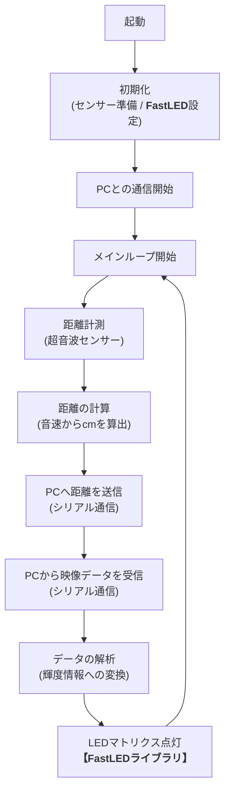
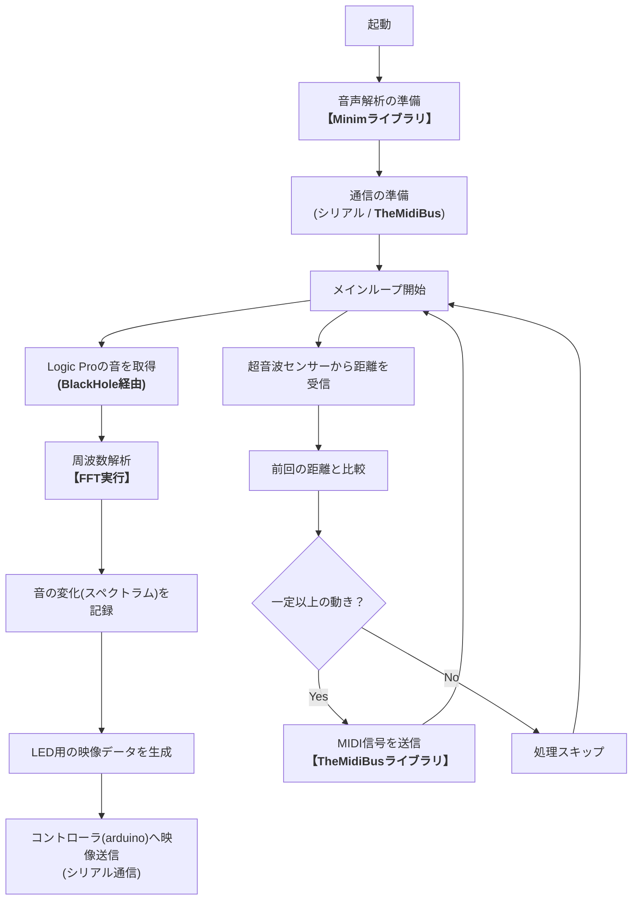

# 卒業制作2025

## 1.  概要 
このプロジェクトは、空中に手をかざすだけで演奏ができ、その音がリアルタイムで光に変わる**エアー楽器**です。  
超音波センサーが「手との距離」を瞬時に読み取り、それを「MIDI（ミディ）信号」に変換します。  
このMIDI信号が「今、この音を鳴らして」とパソコン内の音楽ソフト（Logic Pro）に伝えることで、  
ドラムやシンセサイザーの音を自由自在に鳴らすことができます。  
さらに、鳴った音はすぐに分析され、音の高さやリズムに合わせてLEDが光ります。

### ※MIDI（ミディ）信号とは？  
電子楽器やコンピューターの間で演奏情報をやり取りするための**デジタル言語**です。  
「どの音を（音程）」「どれくらいの強さで（音量）」といった指示がデータ化されており、  
本プロジェクトでは手の距離をこのMIDI信号に翻訳して音を鳴らしています

## 2.  デモ動画

### *主な機能*

- **超音波モジュール**  
  センサーの前に手をかざすと、距離に応じたMIDIノートを生成し、Logic Proでドラム音や効果音を再生します。
　
- **Logic Pro**  
  ArduinoからのMIDI信号をLogic Proで受信し、ソフトウェア音源を鳴らす

- **FFT解析（PC側）**  
  Logic Proの音声出力をPCで取得し、リアルタイムFFT解析を実行する

- **WS2812B LEDマトリクス**  
  解析結果に基づき、8×32のLEDマトリクスにスペクトラムアナライザを表示します。

- **Arduino Uno R4 WiFi**  
  超音波センサーの読み取り、MIDIノートの送信、LED制御を1台で実行します。

### *システムデータフロー*

1.  Arduino Uno R4 WiFi が超音波センサーで距離を読み取り
2.  Logic Pro が IAC Driver 経由でMIDI信号を受信し、ソフト音源を再生
3.  Logic Proの音声出力 を PC内部の「見えないケーブル（BlackHole）」を通してへ送ります
4.   がFFT解析を行い、その情報を再びArduinoへ送り返してLEDを光らせます

## 3.  仕様書

### *配線図*
> ※配線図にはブレッドボード用の電源モジュールは含まれていませんが、このプロジェクトでは電源モジュールの使用することをおすすめします。  
> ※この配線図はFritzingの都合により、以下の部品を代用品で表現しています
> - LEDマトリクス：実際には8×32のWS2812Bマトリクス（データピン：D6）を使用

### *回路図*

### *使用モジュールとピン*

| モジュール名                 | 用途                                | 使用ピン（Arduino Uno R4 WiFi）  |
|---------------------------|-------------------------------------|------------------------------|
| 超音波距離センサー（HC-SR04など） | 手の距離を測定し、MIDIノートを決定        |      TRIG: D10 / ECHO: D9    |
| WS2812B LEDマトリクス（8×32）  | スペクトラムアナライザ表示               | データピン: D6                  |
| Arduino Uno R4 WiFi         | 全体制御（MIDI送信・LED制御）         | -                             |
| PC（Logic Pro + Processing）     | 音声再生・FFT解析・LED制御         | USBシリアル通信                  |

### 使用ツール・環境

- **Arduino IDE**（統合開発環境 / マイコン用コードの開発・書き込み）
- **Logic Pro**（DAW / MIDI受信と音声出力）
- **BlackHole**（仮想オーディオルーティング / ProcessingでLogic Proの音を取得）
- **Audio MIDI設定（IACドライバ）**（Mac標準 / 仮想MIDIポートの作成・接続）

### Arduino使用ライブラリ

| ライブラリ名 | 標準 / 外部 | 用途・詳細 |
| :--- | :--- | :--- |
| **Adafruit_NeoPixel** | 外部ライブラリ | **LED制御** WS2812B LEDマトリクスの制御 |

### IntelliJ IDEA使用ライブラリ

| ライブラリ名 | 標準 / 外部 | 用途・詳細 |
| :--- | :--- | :--- |
| **jSerialComm** | 外部ライブラリ | **Arduinoとのシリアル通信** 距離データの受信、およびLED制御データの送信に使用。 |
| **Java Sound API** | 標準ライブラリ | **MIDI信号・音声処理** IACドライバと併用し、MIDI信号の送信や音声の取得を管理。 |
| **FFT（JTransforms等）** | 外部または自作 | **FFT解析** 音声をリアルタイムで周波数解析し、スペクトラム情報を取得。 |

## 4.  システムブロック図

## 5.  フローチャート

###  *[MIDI楽器コントローラ(Arduino側)]*

###  *[音響解析・映像生成(Processing側)]*

## 6.  使用ツールの詳細

### 🔹**IntelliJ IDEA** 

### 🔹**BlackHole**  
BlackHoleは、macOS用の仮想オーディオドライバです。    
通常、アプリの音声はスピーカーに直接送られますが、BlackHoleを使うことで、その音声を別のアプリ（この場合はIntelliJ）に受け渡すことができます。
このプロジェクトでは、Logic Proで鳴った音をIntelliJに届ける“音の受け渡し役”としてBlackHoleを使用しています。

### 🔹**Audio MIDI設定（IACドライバ）**（macOS標準機能）  
macOS標準のMIDIルーティングツール。   
ArduinoからのMIDIノートをLogic Proに送信するための仮想MIDIポートを作成します。

## 7.  工夫ポイント

### ◎*ArduinoとIntelliJのリアルタイムやりとり*  
ArduinoとIntelliJの間で、
Arduino → IntelliJ：距離センサーのデータを送信  
IntelliJ → Arduino：LEDの表示データを送信  
このように双方向でやり取りすることで、動きや音にすぐ反応する仕組みを実現しています。

### ◎*リアルタイムFFT解析*  
Logic Proで再生された音をBlackHoleを使ってIntelliJに取り込み、 その場で周波数解析（FFT）を行います。  
音の変化に応じて、LEDの光り方をすぐに変化させています。

## 8.  参考サイト

- [基本プロジェクト 超音波](https://docs.sunfounder.com/projects/elite-explorer-kit/ja/latest/basic_projects/06_basic_ultrasonic_sensor.html)
- [【Arduino】シリアルLED（WS2812B）を制御する](https://araisun.com/arduino-serial-led.html)
- [ArduinoでFFT解析し、ピークの周波数を検出する](https://qiita.com/ricelectric/items/98a6d32b1bcfca598762)
- [Audio MIDI設定ユーザガイド](https://support.apple.com/ja-jp/guide/audio-midi-setup/ams1013/mac)
