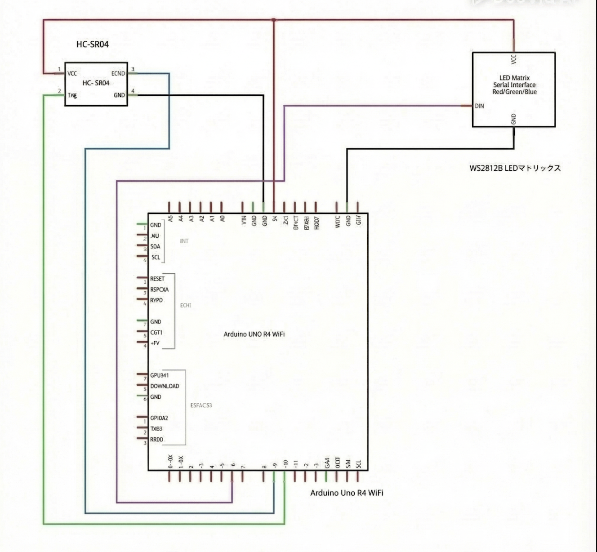
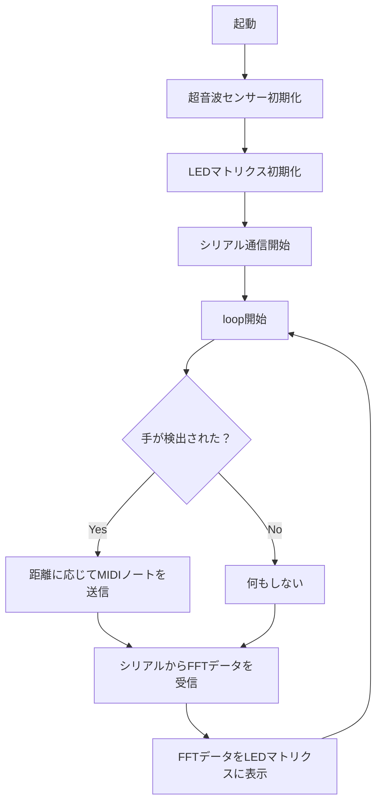

# 卒業制作2025
## 1. 概要 
超音波モジュール + DAW(Logic Pro) + RGB LEDマトリクスを使ったエアー楽器

### *主な機能*

- **超音波モジュール**  
  センサーの前に手をかざすと、距離に応じて異なるMIDIノートを生成し、Logic Proでドラム音や効果音を再生する
　
- **Logic Pro**  
  ArduinoからのMIDI信号をLogic Proで受信し、ソフトウェア音源を鳴らす

- **FFT解析（PC側）**  
  Logic Proの音声出力をPCで取得し、リアルタイムFFT解析を実行する

- **WS2812B LEDマトリクス**  
  PCで解析した音の強さや周波数に応じて、8×32のLEDマトリクスにスペクトラムアナライザを表示する

- **Arduino Uno R4 WiFi**  
  MIDI信号の送信、LED制御を1つのマイコンで実現する

### *システム構成*

1. Arduino Uno R4 WiFi で超音波センサーの距離を測定し、MIDI信号をUSB経由で送信
2. Logic Pro  が IAC Driver からMIDIを受信し、ソフト音源を再生
3. Logic Pro の音声出力を BlackHole 経由で Processing に渡す
4. Processing でFFT解析を行い、LEDマトリクスにスペクトラム表示

## 2. 仕様書

### *配線図*
> ※この配線図はFritzingの都合により、以下の部品を代用品で表現しています
> - LEDマトリクス：実際には8×32のWS2812Bマトリクス（データピン：D6）を使用

### *回路図*

### *使用モジュールとピン*

| モジュール名              | 用途                                | 使用ピン（Arduino Uno R4 WiFi）     |
|---------------------------|-------------------------------------|------------------------------|
| 超音波距離センサー（HC-SR04など） | 手の距離を測定し、MIDIノートを決定        |      TRIG: D10 / ECHO: D9    |
| WS2812B LEDマトリクス（8×32） | スペクトラムアナライザ表示                | データピン: D6                  |
| Arduino Uno R4 WiFi       | 全体制御（MIDI送信・LED制御・入力処理）     | -                             |
| PC（Logic Pro + FFT解析）       | 音声再生・FFT解析・LED表示データ送信    | USBシリアル通信                  |

### 使用ツール・環境

- **Arduino IDE**（統合開発環境 / マイコン用コードの開発・書き込み）
- **Processing**（ビジュアルプログラミング環境 / 音声解析とシリアル通信）
- **Logic Pro**（DAW / 音声出力・ドラム音源の再生）
- **BlackHole**（仮想オーディオルーティング / ProcessingでLogic Proの音を取得）
- **Audio MIDI設定（IACドライバ）**（Mac標準 / 仮想MIDIポートの作成・接続）

### Arduino使用ライブラリ

- **Adafruit_NeoPixel**（LEDマトリクス制御用ライブラリ）

### Processing使用ライブラリ

- **processing.sound**（音声入力とFFT解析用）
- **processing.serial**（Arduinoとのシリアル通信）

## 3. フローチャート

## 4. 使用ツールの詳細

### **Processing** 
Processingは、ビジュアル表現に特化したJavaベースのプログラミング環境です。 このプロジェクトでは、Logic Proで再生された音声をリアルタイムに解析し、周波数ごとの強さを可視化する役割を担っています。 また、解析したデータをArduinoに送信し、LEDマトリクスに音のスペクトラムを表示するための橋渡し的存在でもあります。

### **BlackHole**  
BlackHoleは、macOS用の仮想オーディオドライバです。  
通常、アプリの音声はスピーカーに直接送られますが、BlackHoleを使うことで、その音声を別のアプリ（この場合はProcessing）に受け渡すことができます。 
このプロジェクトでは、Logic Proで鳴った音をProcessingに届ける“音の受け渡し役”としてBlackHoleを使用しています。

### **Audio MIDI設定（IACドライバ）**（macOS標準機能）  
仮想MIDIポートを作成・管理するためのmacOS標準ツールです。Hairless MIDIとLogic Proを接続するために使用しています。

## 5. 参考サイト

- [基本プロジェクト 超音波](https://docs.sunfounder.com/projects/elite-explorer-kit/ja/latest/basic_projects/06_basic_ultrasonic_sensor.html)
- [【Arduino】シリアルLED（WS2812B）を制御する](https://araisun.com/arduino-serial-led.html)
- [ArduinoでFFT解析し、ピークの周波数を検出する](https://qiita.com/ricelectric/items/98a6d32b1bcfca598762)
- [arduinoとprocessingの連携手順](https://note.com/nakariho/n/n92611b3c0046)
- [Audio MIDI設定ユーザガイド](https://support.apple.com/ja-jp/guide/audio-midi-setup/ams1013/mac)
